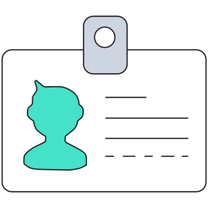
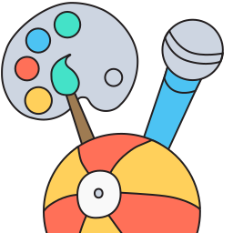
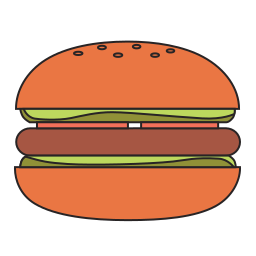
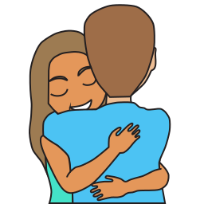
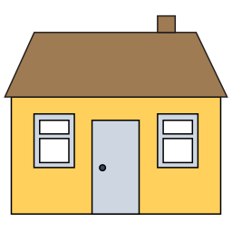
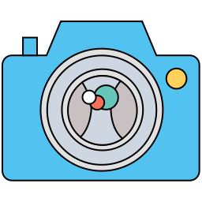
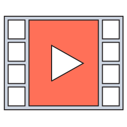
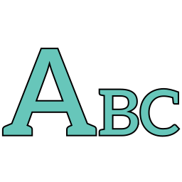
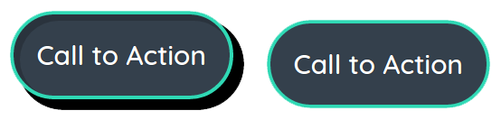

Todo: Mention box packing algorithm

Todo: Dashboard/Topics UI screenshots

Daybook is a digital diary prototype aimed at helping to improve communications between people with learning disabilities and those that support and services.

Delivered as an app experience, Daybook allowed users to share moments or stories by entering text, taking a photo or recording a video.

With users having such a broad range of disabilities to consider, several revisions of the UI/UX were developed. It was important that the amount of interactions possible on a screen was heavily restricted, call to actions were clear and that actions provided useful and appropriate feedback to the user.

By learning some Adobe Illustrator basics, I was able to design a logo, icons for topics, feelings and entry type.

  
  
  
  
  
  
  
  

  
  

  
  
  

Todo: Haptic feedback buttons

