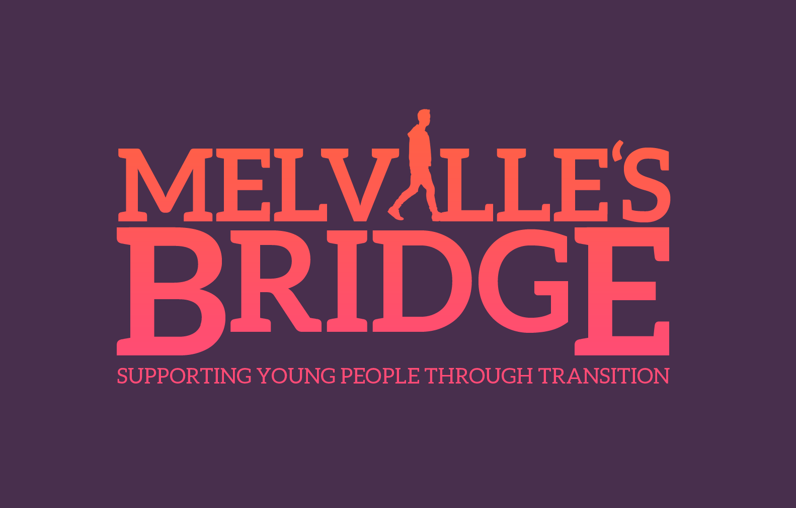

  

  

  

Melville's Bridge was an organisation with the objective of supporting housing for 16-25 year olds and helping them through transition to full independence, many focused on care leavers but not exclusively.

  

  

Without a brief, I was given the opportunity to come up with a logo. I kept the design simple by rendering type in the shape of a bridge with a silhouette shaped person walking across it, towards a life of independence.

  

  

  

